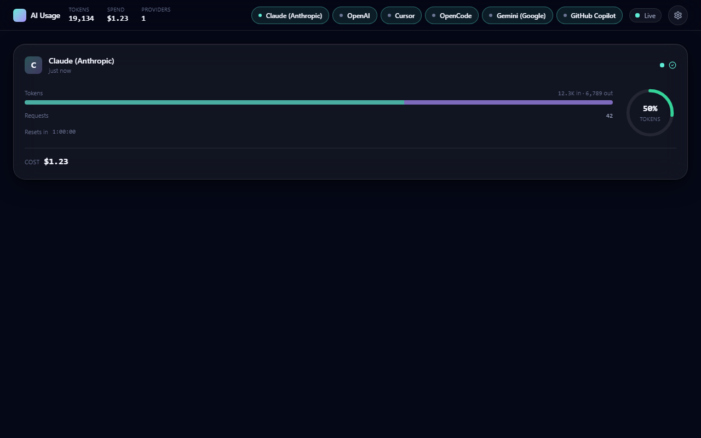

# AI Usage Dashboard

Real-time multi-provider AI usage in one sleek dashboard.

[](https://github.com/tomasthorv/ai-usage-dash/actions/workflows/ci.yml)
[](./LICENSE)
[](https://vercel.com/new/clone?repository-url=https%3A%2F%2Fgithub.com%2Ftomasthorv%2Fai-usage-dash&env=MASTER_KEY)
[](https://github.com/tomasthorv/ai-usage-dash/pkgs/container/ai-usage-dash)



A self-hosted dashboard that aggregates token usage, spend, and quota for Claude, OpenAI, Cursor, OpenCode, Gemini, and GitHub Copilot. Keys are encrypted at rest with libsodium sealed boxes and never sent to the browser. Updates stream over SSE.

## Quickstart

```
git clone https://github.com/tomasthorv/ai-usage-dash
cd ai-usage-dash
pnpm install && pnpm dev
```

Open http://localhost:3000 — setup wizard appears, no .env editing required for local dev.

## Deploy

### Vercel

[](https://vercel.com/new/clone?repository-url=https%3A%2F%2Fgithub.com%2Ftomasthorv%2Fai-usage-dash&env=MASTER_KEY)

You will be prompted for `MASTER_KEY` (32 random bytes, base64-encoded). Generate one with `pnpm exec tsx scripts/generate-master-key.ts`.

### Docker

```
docker run -p 3000:3000 -v ai-usage-data:/data ghcr.io/tomasthorv/ai-usage-dash:latest
```

### Bare Node

```
pnpm build && pnpm start
```

## Providers

| Provider | Status | Tracked | Key docs |
|---|---|---|---|
| Claude (Anthropic) | official | tokens, cost, rate-limit quota | [Anthropic admin keys](https://docs.anthropic.com/en/api/admin-api) |
| OpenAI | official | tokens, cost, monthly hard limit | [OpenAI admin keys](https://platform.openai.com/docs/api-reference/admin) |
| Cursor | official + unofficial | team usage, individual cookie fallback | [Cursor API](https://docs.cursor.com/account/api-keys) |
| OpenCode | best-effort | local SQLite reads | n/a (local only) |
| Gemini (Google) | official (ceiling only) | quota ceilings, no consumed | [Cloud Quotas](https://cloud.google.com/docs/quotas) |
| GitHub Copilot | official (per-seat) | seats, billing cycle | [Copilot admin PAT](https://docs.github.com/en/enterprise-cloud@latest/copilot/managing-copilot/managing-copilot-as-an-individual-subscriber) |

## Architecture

Next.js 15 App Router with a Node-runtime SSE multiplexer, a single-process poller that fans out to provider adapters, and `better-sqlite3` for credentials and snapshot durability. See [PLAN.md](./PLAN.md) and [ARCHITECTURE.md](./ARCHITECTURE.md) for the full spec.

## Adding a Provider

Drop a new file in `lib/providers/`, implement `ProviderAdapter` from [lib/providers/types.ts](./lib/providers/types.ts), add it to the registry array, and write a fixture and unit test. Target is under 50 LOC plus one test file.

## Development

```
pnpm dev
pnpm test
pnpm build
```

Supported on Windows Git Bash, macOS, and Linux. CI runs the full matrix.

## Security

Keys are encrypted at rest with libsodium sealed boxes and never sent to the browser. See [SECURITY.md](./SECURITY.md) for the threat model and reporting process.

## License

[MIT](./LICENSE).
